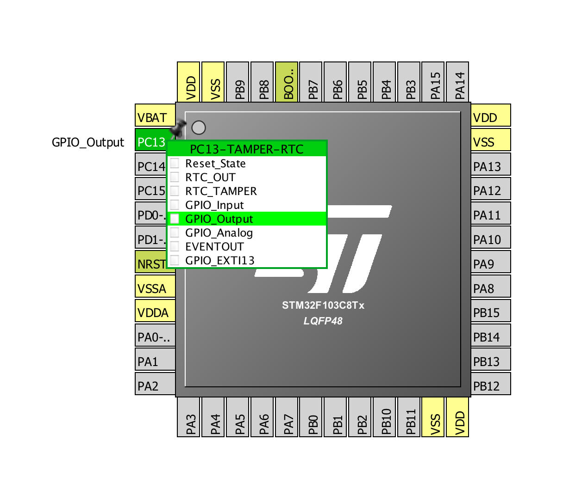

# pill\_blink, STM32CubeMX version

To build this project:

1. Ensure you have the ARM GCC compiler installed (e.g. install [Homebrew](https://brew.sh), run `brew cask install gcc-arm-embedded`)
2. `make`
3. The binary should now be available for flashing in build/blink.bin

To recreate this project from scratch:

1. Install [STM32CubeMX](http://www.st.com/content/st_com/en/products/ecosystems/stm32-open-development-environment.html)
2. New Project, enter "STM32F103C8" in Part Number Search, select STM32F103C8 then Start Project
3. Project, Settings..., change Toolchain / IDE to "Makefile"
4. Click on the PC13 pin and in the drop-down menu choose "GPIO_Output":



5. Project > Generate Code
6. Edit Makefile, changing BINPATH to where the compiler is installed (/usr/local/bin if you used [Homebrew](https://brew.sh): `brew cask install gcc-arm-embedded`)
7. Edit Makefile and remove duplicate `C_SOURCES` (workaround known [CubeMX bug report: Error in generating Makefile](http://archive.is/kGHXF))
8. Edit Src/main.c and add after `/* USER CODE BEGIN WHILE */`:

```c
  /* USER CODE BEGIN WHILE */
  while (1)
  {
    GPIOC->BRR |= 1<<13;
    for (int i = 0; i < 1000000; ++i) asm("nop");
    GPIOC->BSRR |= 1<<13;
    for (int i = 0; i <  500000; ++i) asm("nop");
  /* USER CODE END WHILE */
```
